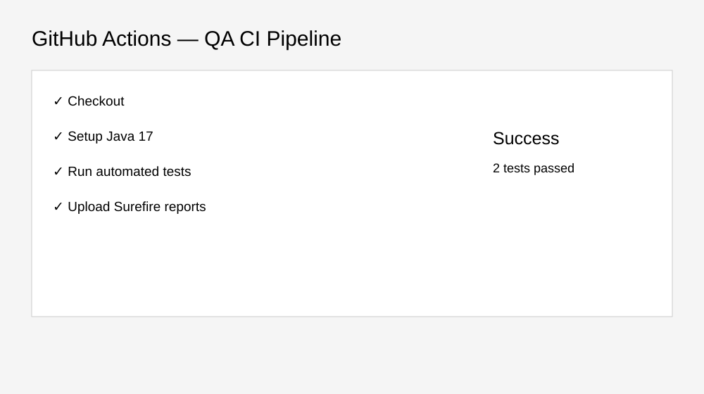
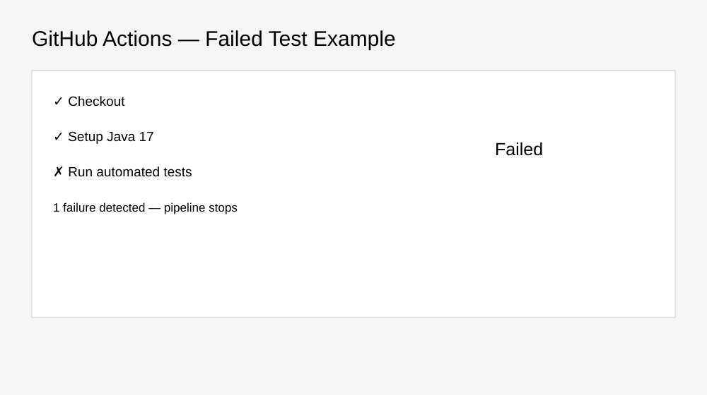
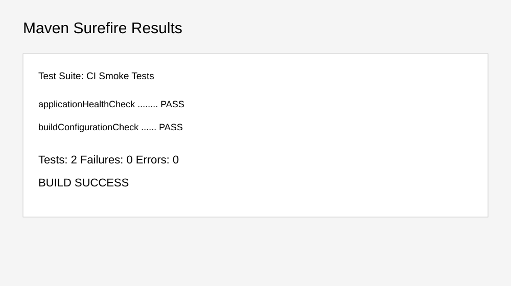

# 🔄 CI/CD Testing Project

A portfolio-ready GitHub Actions testing project demonstrating how automated tests can run automatically on every push and pull request.

## Objectives
- Configure CI pipeline
- Build a Maven project
- Execute automated tests
- Publish test results
- Demonstrate failure handling and regression execution

## Structure
```text
CI-CD-Testing-Project/
├── README.md
├── pom.xml
├── src/test/java/ci/SmokeTest.java
├── .github/workflows/ci.yml
├── test-results/README.md
└── Screenshots/
    ├── workflow-success.svg
    ├── workflow-failure.svg
    └── test-results.svg
```

## Pipeline Stages
1. Checkout source
2. Setup Java 17
3. Cache Maven dependencies
4. Run `mvn clean test`
5. Upload Surefire reports

## Workflow Trigger
The workflow runs on pushes to `main` and pull requests targeting `main`.

## Screenshots






> Screenshots are documentation mockups illustrating CI/CD evidence; they are not claimed as actual GitHub Actions run history.

## Tools
GitHub Actions • Java • Maven • JUnit 5 • CI/CD • Automated Testing

**Author:** Keerthi Kandula
